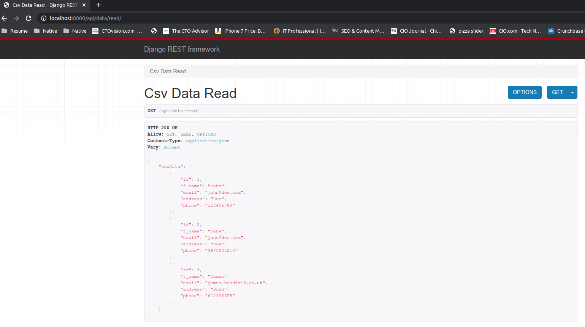

# CSV Data Read API Service

## Requirement:

    Read and CSV file from system and Update data in DB
    Expose an API for the service
    Note:
        1. Ensure that the code is as modular as possible.
        2. Specs are must

## Solution:

## API Diagram: You can read and update data by running your local server and then go to (http://127.0.0.1:8000/api/data/read/)

### Setup:

## Make Python 3 Virtual Environment

    virtualenv -p python3 toolenv

## Activate Virtualenv

     * source toolenv/bin/activate

## Now Go to Main Repo:

     * cd <repo folder>

## Install all the python dependency

     pip install -r requirement.txt

## Make Python Migrations

     ● python manage.py makemigrations

## Make Migrations

    python manage.py migrate

## Now Run The backend Server

    python manage.py runserver

### Backend Architectue

1. DataStore : It has datastore model that has f_name, address, email and phone field

## API Structure

    * Data Read API url": "http://127.0.0.1:8000/api/data/read/",

## API View Strucutre:

    ● Viewset.py : It keeps all the api viewset
    ● serializer.py : It keeps all the Input Data/Output Data formats
    ● permissons.py: It contains all the permission regarding the api endpoint
